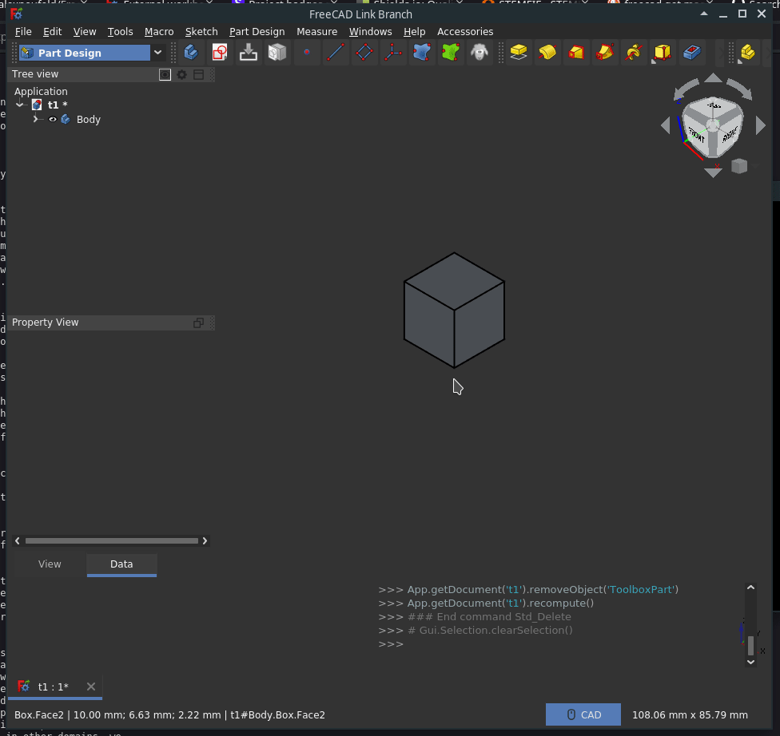
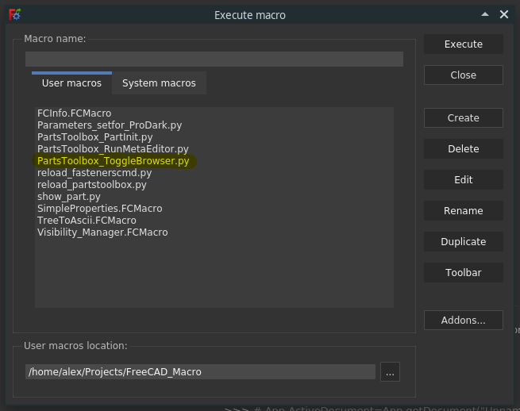
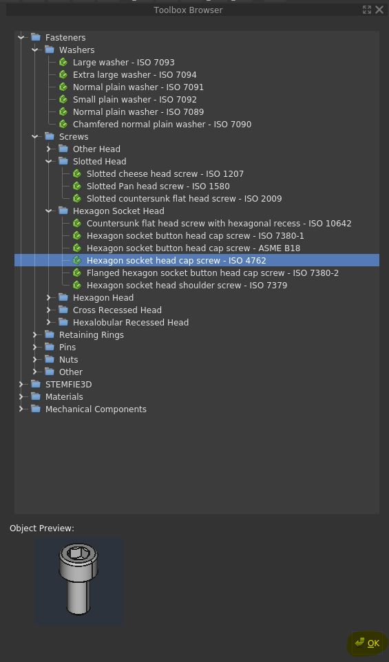
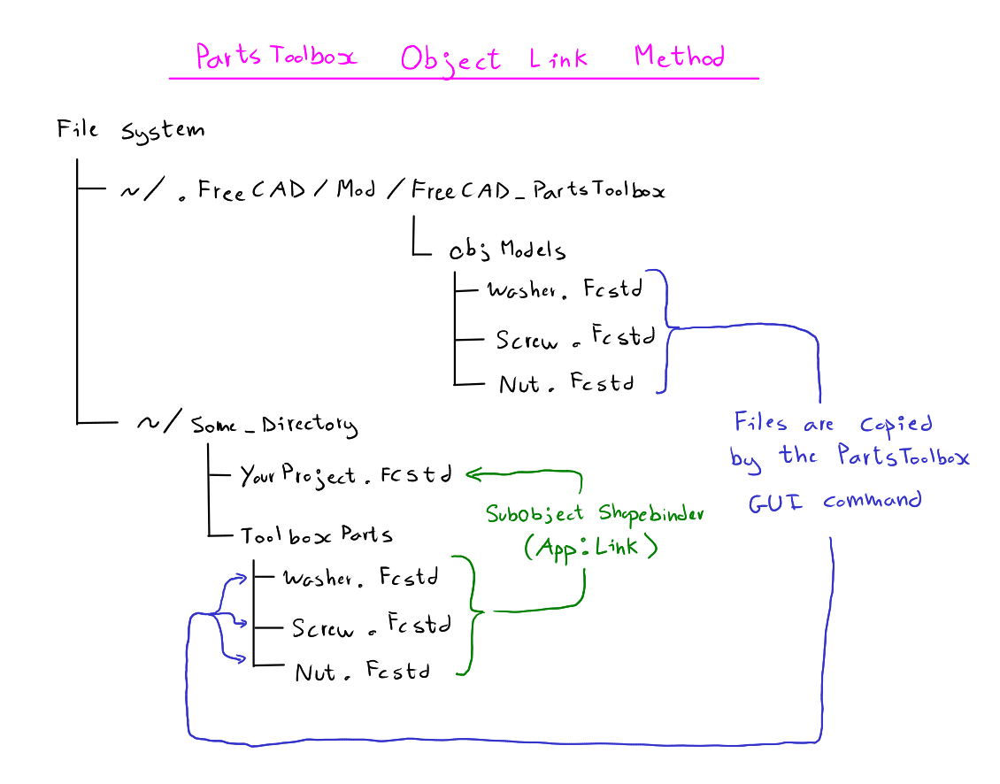

## FreeCAD Parts Toolbox 

[](https://lgtm.com/projects/g/alexneufeld/FreeCAD_PartsToolbox) 
[](https://lgtm.com/projects/g/alexneufeld/FreeCAD_PartsToolbox/context:python) 

Copies standardized parts into your FreeCAD projects.




## Installing

The library uses features of FreeCAD's expression engine that aren't available in the 0.19.1 release. Go grab a recent version of the Realthunder branch [here](https://github.com/realthunder/FreeCAD_assembly3/releases).  

Clone this repository to the appropriate directory:

```
cd ~/.FreeCAD/Mod
git clone git@github.com:alexneufeld/FreeCAD_PartsToolbox.git
```

this module will now be loaded every time FreeCAD starts up.


## Usage

Once installed, some new [macros](https://wiki.freecadweb.org/Macros) will be available in the macro dialog.



Select and run `PartsToolbox_ToggleBrowser.py`. A GUI panel opens, and you can select parts to add to the active FreeCAD document.



## How it Works

Parts are provided as `.FCStd` files. We use FreeCAD's existing 
ability to create parametric objects to our advantage.
The user facing command provided by this toolbox just copies
document objects from files in the `ObjModels` directory to
the active document. This approach has the advantage that no python 
code is required to add a new part to the library, which allows for 
faster growth of the toolbox.

For a better understanding of how parametric parts are implemented here, take a look at `ObjModels/DIN557.FCStd`. Also check out [This FreeCAD forum post.](https://forum.freecadweb.org/viewtopic.php?f=17&t=42183)



## License
GPLv3 (see [LICENSE](LICENSE))

## Acknowledgements

Much of the dimensional data on objects provided by the toolbox
is based on the [FreeCAD_FastenersWB](https://github.com/shaise/FreeCAD_FastenersWB) and [BOLTS](https://github.com/boltsparts/BOLTS) projects. 

This module also tentatively includes parts from the [STEMFIE](https://stemfie.org/) project. 
