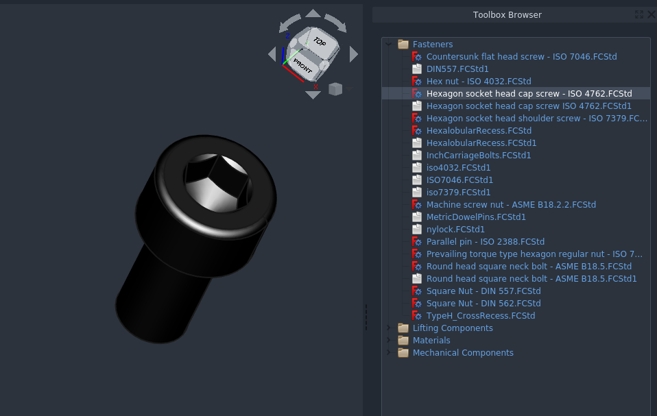

### FreeCAD Parts Toolbox 

Copies standardized parts into your FreeCAD projects. 
Conceptually similar to utilities with the same name 
available for other closed-source CAD software



### Installing

The library uses features of FreeCAD's expression engine that aren't available in the 0.19.1 release. Go grab a recent version of the Realthunder branch [here](https://github.com/realthunder/FreeCAD_assembly3/releases).  

Clone this repository to the appropriate directory:

```
cd ~/.FreeCAD/Mod
git clone git@github.com:alexneufeld/FreeCAD_PartsToolbox.git
```

You'll then have to use the [customization tool](https://wiki.freecadweb.org/Customize_Toolbars) to add the partsToolBox commands to a custom toolbar.

### How it Works

Parts are provided as `.FCStd` files. We use FreeCAD's existing 
ability to create parametric objects to our advantage.
The user facing command provided by this toolbox just copies
document objects from files in the `ObjModels` directory to
the active document. This approach has the advantage that no python 
code is required to add a new part to the library, which allows for 
faster growth of the toolbox.

For a better understanding of how parametric parts are implemented here, take a look at `ObjModels/DIN557.FCStd`. Also check out [This FreeCAD forum post.](https://forum.freecadweb.org/viewtopic.php?f=17&t=42183)

### Acknowledgements

Much of the dimensional data on objects provided by the toolbox
is based on the [FreeCAD_FastenersWB](https://github.com/shaise/FreeCAD_FastenersWB) and [BOLTS](https://github.com/boltsparts/BOLTS) projects. 

Toolbox icon: [Adib Sulthon](https://www.flaticon.com/authors/adib-sulthon) - [www.flaticon.com](https://www.flaticon.com/)